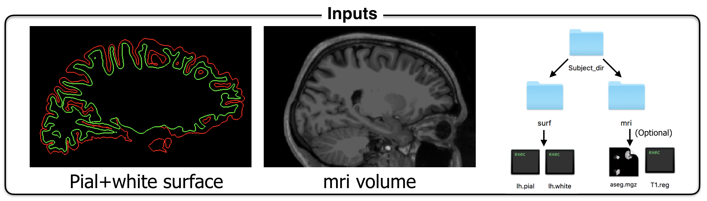
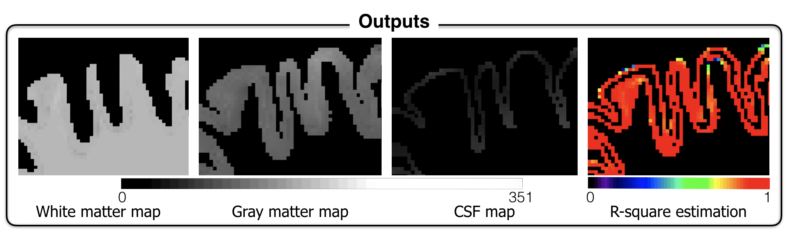

# partial_volume_correction
Partial Volume Effect (PVE) hampers the accuracy of studies aiming at mapping MRI signal in the cortex due to the close proximity of adjacent white matter (WM) and cerebrospinal fluid (CSF). The proposed framework addresses this issue by disentangling the various sources of MRI signal within each voxel, assuming three classes (WM, gray matter, CSF) within a small neighbourhood. This tool allow accurate extraction of MRI metrics using surface-based analysis. This tool can be particularly useful for probing pathology in outer or inner cortical layers, which are subject to strong PVE with adjacent CSF or WM.

# Dependencies 
* freesurfer 5.3 
* matlab R2016_a

# Installation
* Download the above functions
* Add the folder code to your Matlab path
* Launch a matlab tab from the console
* Run the function *pvc_partial_volume_estimation*

# Inputs:
* mri volume registered on the surface
* subject DIR path

__OPTIONS__:
* reg file (if the volume has been registred on the surface)
* path for output
__METHOD OPTION__:
* second_correction: default False. If the mri volume is isotropic, possibility of adding a second partial volume correction (for more inofrmation, see the abstract in the DOC directory). 

## Outputs
* White matter mask
* Grey matter mask
* CSF mask 
* r2 map in specified path or in current folder 

                                                                                        
## Examples
If the mri volume is the same resolution than the aseg file:
_pvc_partial_volume_estimation(‘/sujet_test/mri/T1.mgz’, ‘/sujet_test’, [1 1 1])_;

If the resolution of the mri volume is different from the aseg file:
_pvc_partial_volume_estimation(‘/sujet_test/mri/T1.mgz’, ‘/sujet_test’, [1 1 1], ‘subject_test/mri/aseg.mgz, ‘subject_test/mri/T1_surfreg.reg’)_;
