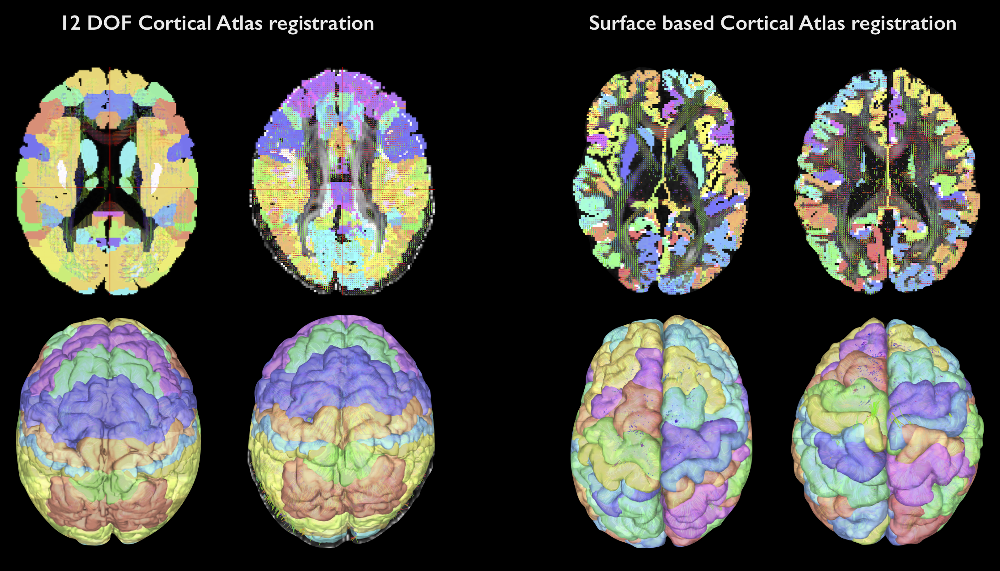

# Creation of a custom surface-based atlas
Procedure to obtain volumetric atlases accurately registered on subjects’ cortical areas and other regions of interest (ROIs). 

# Dependencies 
* freesurfer 5.3 
* matlab R2016_a

# Installation
* Download the above functions
* Add the folder code to your Matlab path
* Launch a matlab tab from the console

# Pseudo-code
* a) Cortical areas
- mri_annotation2label : create labels from PALS-B12 (surface atlas in
fsaverage space, can work with any surface atlas in any space)
loop on Subjects
loop on PALS-B12 labels (BAs)
- mri_label2label : convert labels from fsaverage space to subject’s native space.
- mri_label2vol : convert labels to expanded volumetric ROIs in the diffusion space.
end loop Labels end loop Subjects
* b) Aseg areas (e.g. deep GM) loop on Subjects
- mri_label2vol : sending FreeSurfer Aseg to the diffusion space. loop on wanted Aseg labels (areas)
- fslmaths : selecting wanted aseg labels end loop Labels
end loop Subjects
* c) concatenate (optional)
loop on Subjects
- mri_concat : concatenate all ROIs in one atlas file (per subject)
 end loop Subjects
          
## Examples

Example of a cortical atlas registration performed using a standard 12-DOF method and by using the surface-based method described here.

# Authors
- Gabriel Mangeat
- Julien Cohen-Adad

# License
The MIT License (MIT)

Copyright (c) 2017 Ecole Polytechnique, Université de Montréal

Permission is hereby granted, free of charge, to any person obtaining a copy
of this software and associated documentation files (the "Software"), to deal
in the Software without restriction, including without limitation the rights
to use, copy, modify, merge, publish, distribute, sublicense, and/or sell
copies of the Software, and to permit persons to whom the Software is
furnished to do so, subject to the following conditions:

If you use this code, please cite: "Mangeat G, Badji A, Ouellette R, et al.
Changes in structural network are associated with cortical
demyelination in early multiple sclerosis. Hum Brain Mapp.
2018; 00:1–14. https://doi.org/10.1002/hbm.23993"

The above copyright notice and this permission notice shall be included in all
copies or substantial portions of the Software.

THE SOFTWARE IS PROVIDED "AS IS", WITHOUT WARRANTY OF ANY KIND, EXPRESS OR
IMPLIED, INCLUDING BUT NOT LIMITED TO THE WARRANTIES OF MERCHANTABILITY,
FITNESS FOR A PARTICULAR PURPOSE AND NONINFRINGEMENT. IN NO EVENT SHALL THE
AUTHORS OR COPYRIGHT HOLDERS BE LIABLE FOR ANY CLAIM, DAMAGES OR OTHER
LIABILITY, WHETHER IN AN ACTION OF CONTRACT, TORT OR OTHERWISE, ARISING FROM,
OUT OF OR IN CONNECTION WITH THE SOFTWARE OR THE USE OR OTHER DEALINGS IN THE
SOFTWARE.
