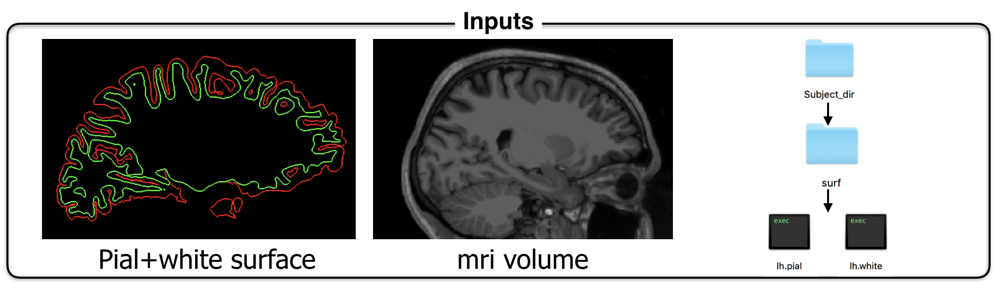
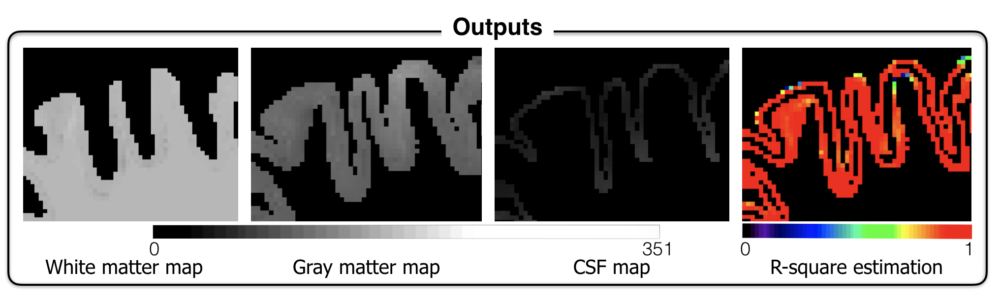

# partial_volume_correction
Partial Volume Effect (PVE) hampers the accuracy of studies aiming at mapping MRI signal in the cortex due to the close proximity of adjacent white matter (WM) and cerebrospinal fluid (CSF). The proposed framework addresses this issue by disentangling the various sources of MRI signal within each voxel, assuming three classes (WM, gray matter, CSF) within a small neighbourhood. This tool allow accurate extraction of MRI metrics using surface-based analysis. This tool can be particularly useful for probing pathology in outer or inner cortical layers, which are subject to strong PVE with adjacent CSF or WM.

# Dependencies 
* freesurfer 5.3 
* matlab R2016_a

# Installation
* Download the above functions
* Add the folder code to your Matlab path
* Launch a matlab tab from the console
* Run the function *pvc_partial_volume_estimation*

# Inputs:
* isotropic mri volume registered on the surface
* subject DIR path

__OPTIONS__:
* path for output

__METHOD OPTION__:
* second_correction: default False. If the mri volume is isotropic, possibility of adding a second partial volume correction (for more inofrmation, see the abstract in the DOC directory). 

## Outputs
* White matter mask
* Grey matter mask
* CSF mask 
* r2 map in specified path or in current folder 

                                                                                        
## Examples

Example for an 1mm isotropic image. If the image is not isotropic, put the bigger dimension
_pvc_partial_volume_estimation(‘/sujet_test/mri/T1.mgz’, ‘/sujet_test’, 1, '/sujet_test/output_dir', true)_;

_ATTENTION_
You need the writting permission of your subject directory. Be carreful if your subjects are in your Freesurfer file !

# Authors
- Camille Van-Assel
- Gabriel Mangeat
- Julien Cohen-Adad

# License
The MIT License (MIT)

Copyright (c) 2016 Ecole Polytechnique, Université de Montréal

Permission is hereby granted, free of charge, to any person obtaining a copy
of this software and associated documentation files (the "Software"), to deal
in the Software without restriction, including without limitation the rights
to use, copy, modify, merge, publish, distribute, sublicense, and/or sell
copies of the Software, and to permit persons to whom the Software is
furnished to do so, subject to the following conditions:

If you use this code, please cite: "Van Assel, C., Mangeat, G., De Leener, D., Stikov, N., Mainero, C., Cohen-Adad, J., (2017). Partial volume effect correction for surface-based cortical mapping. In
ISMRM. Honolulu, 2017."

The above copyright notice and this permission notice shall be included in all
copies or substantial portions of the Software.

THE SOFTWARE IS PROVIDED "AS IS", WITHOUT WARRANTY OF ANY KIND, EXPRESS OR
IMPLIED, INCLUDING BUT NOT LIMITED TO THE WARRANTIES OF MERCHANTABILITY,
FITNESS FOR A PARTICULAR PURPOSE AND NONINFRINGEMENT. IN NO EVENT SHALL THE
AUTHORS OR COPYRIGHT HOLDERS BE LIABLE FOR ANY CLAIM, DAMAGES OR OTHER
LIABILITY, WHETHER IN AN ACTION OF CONTRACT, TORT OR OTHERWISE, ARISING FROM,
OUT OF OR IN CONNECTION WITH THE SOFTWARE OR THE USE OR OTHER DEALINGS IN THE
SOFTWARE.
